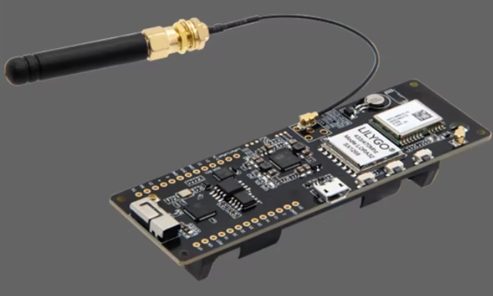
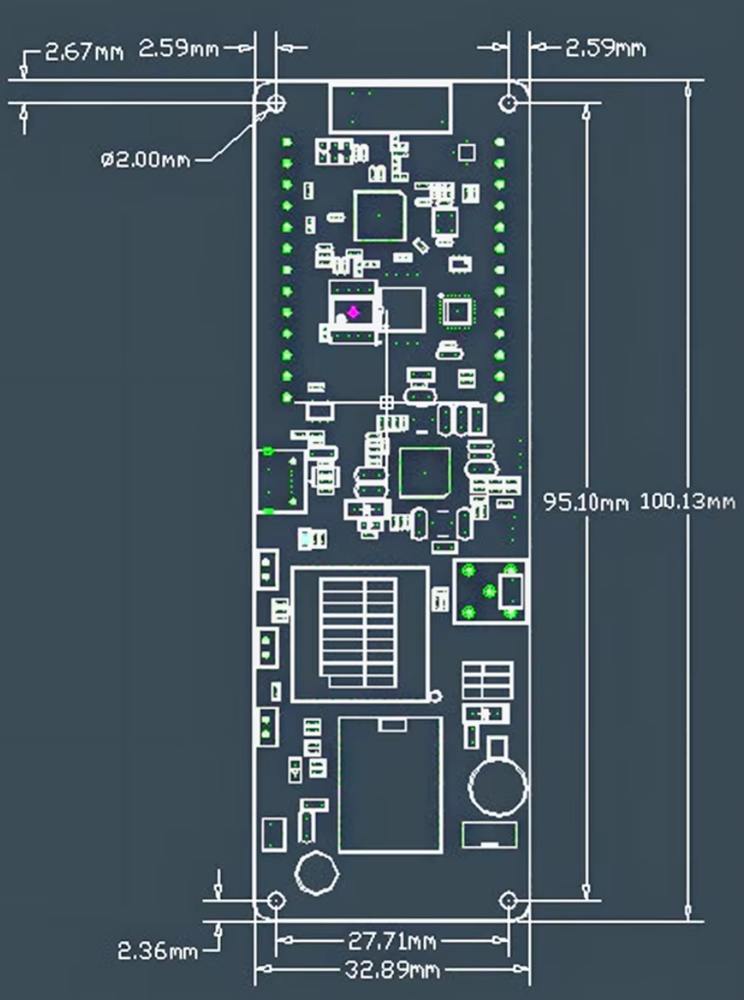

# T-Beam LoRa “Hello” Link (Sender + Receiver) — RadioLib (SX1262, 868 MHz)

A minimal two-device project using **two LILYGO T-Beam V1.2 (ESP32 + SX1262)** boards to communicate over **LoRa** in the **EU 868 MHz** band.

---

## What is LoRa (in plain words)?

**LoRa** is a long-range, low-power radio technology.  
Think of it like “walkie-talkies for tiny data”:

- ✅ Works over long distances (often hundreds of meters to kilometers depending on environment)
- ✅ Uses very little power
- ✅ Sends small messages (not suitable for high-speed data like Wi‑Fi)

In this project, LoRa is used to send a simple text message from one board to another.

---

## Software Overview

This repository contains one program:

The  program uses the **RadioLib** library to control the **SX1262 LoRa radio** on the T-Beam.

---

## Program Logic (How it works)

This is the ping pong example of radiolib, adapted for T-BEAM as below. The program checks, if a packet was received and prints out data, Signal strength and Signal-to-Noise Ratio. Then it waits a second, and sends itself a message. The initial message is in setup, starting with INITIATING_NODE. When uploading the program, in one of the 2 devices , the line #define INITIATING_NODE must be commented out, then it's clear which device starts the communication.

---

## Features

- ✅ Uses **EU 868 MHz** frequency
- ✅ Uses **RadioLib** (SX1262 support)

---

## Hardware / Components Used

### Boards
- **2× LILYGO T-Beam V1.2**
  - MCU: **ESP32**
  - LoRa radio: **SX1262**
  - GPS: **NEO-M8N**
  - PMU: **AXP2101**
  - USB-UART: **CH9102**
  - Flash: 4MB, PSRAM: 8MB
  - Marking: *LILYGO 868/915 MHz Model: LORA32 SX1262*

### Region / Frequency
- **Europe (EU): 868 MHz** is used in the code:
  - `static const float LORA_FREQ = 868.0;`

> ⚠️ Always follow your local radio regulations (frequency, transmit power, duty cycle).

## Dependencies / Libraries Used
 - Arduino framework (ESP32)
 - RadioLib by Jan Gromeš

	Used to control the SX1262 LoRa radio.
	In PlatformIO, you typically add:

	lib_deps =
	  jgromes/RadioLib
	Build & Flash (PlatformIO)

## Prerequisites
- Install VS Code
- ✅ Install the PlatformIO extension
- Connect your T-Beam via USB (CH9102 driver may be required depending on your OS)
- Compile & Upload
   
- Open the sender project and run:
- Build
- Upload
- Monitor (Serial Monitor at 115200 baud)
-Repeat for the receiver project.

-Serial Monitor Settings
-Baud rate: 115200

## Sender output example:

## Usage

## Future Improvements
-	Add deep sleep for low-power battery operation
-	Add structured payloads (JSON or binary packets)
## Acknowledgements
-	RadioLib library by Jan Gromeš and contributors
-	LILYGO for the T-Beam hardware platform
## License
-	This project is licensed under the MIT License. See the LICENSE file for details.

## Images
1. 

2. 

3.

